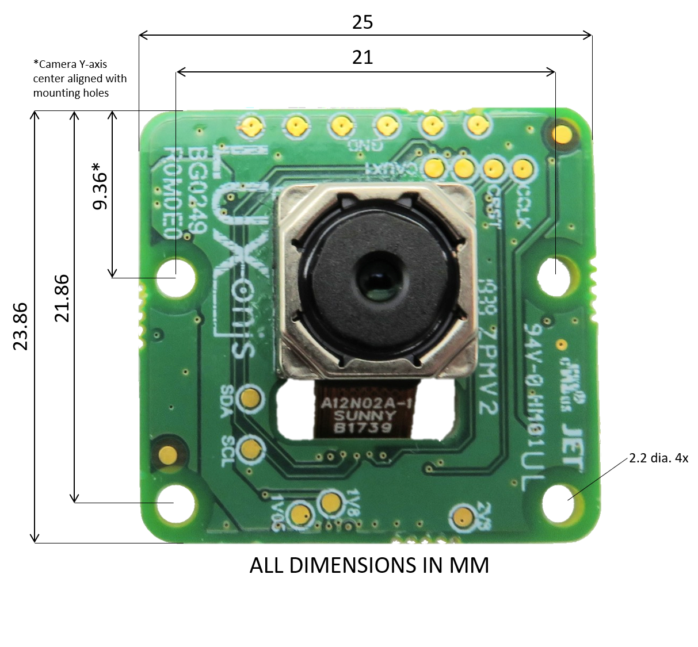
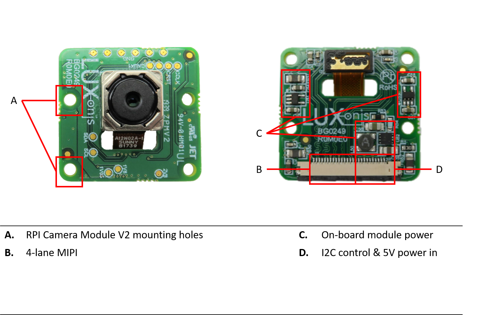

# BG0249_R1M1E1 RGB Camera Module

# Overview
This repository contains open hardware designed by Luxonis. The BW0249 is a carrier board for the Sunny A12N02A IMX378 camera module, and is designed to be compatible with the [BW1094](https://github.com/luxonis/depthai-hardware/tree/master/BW1094_DepthAI_HAT) and [BW1098FFC](https://github.com/luxonis/depthai-hardware/tree/master/BW1098FFC_DepthAI_USB3) baseboards. A 26-pin FFC is used to carry 5V power, 4-lane MIPI, I2C, and other control signals between the BW0249 and the controller baseboards. 

# Repository structure:
* `PCB` contains the packaged Altium project files
* `Docs` contains project output files
* `Images` contains graphics for readme and reference
* `3D Models` contains generated 3D models of the board
# Key features
* 26 pin 0.5mm FFC interconnect to baseboard
* 30 pin interface to IMX378 camera module
* 4-lane MIPI
* Aux/Control signals to camera module
* 5V power input via FFC
* On-board power generation for camera module
* Design files produced with Altium Designer 20

# Board layout & dimensions

# Getting started  
Camera module compatibility is known for the Sunny A12N02A, but not tested for other modules. The FFC connector is an 0.5mm pitch, 26-pin, and bottom-contact, across which travels the 4-lane MIPI, 5V, I2C, camera clock, camera reset, and other optional control lines. 5V power is regulated down and filtered as appropriate to meet the requirements of the compact camera module and IMX378.  

# Revision info
These files represent the R1M1E1 revision of this project. Please refer to schematic page, `Project_Information.SchDoc` for full details of revision history.
