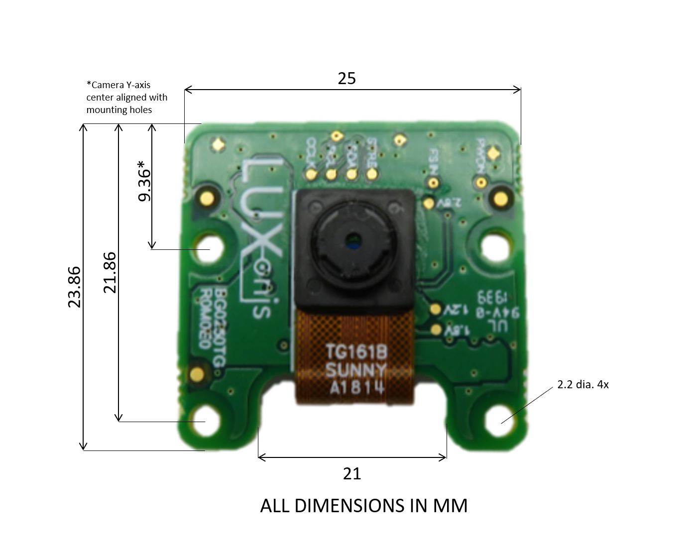
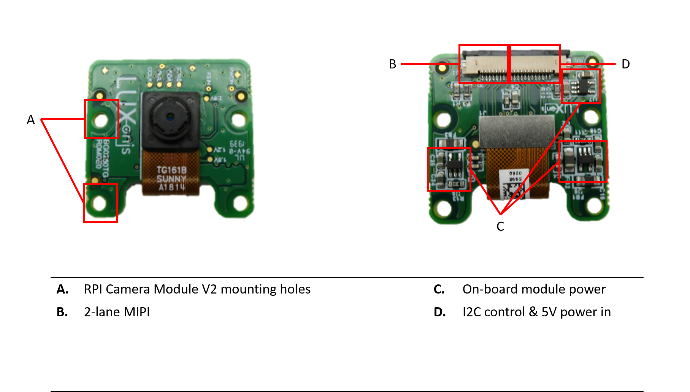

# BG0250TG_R0M0E0 Mono Camera Module

[Documentation here](https://docs.luxonis.com/projects/hardware/en/latest/pages/BG0250TG.html)

# Overview
This repository contains open hardware designed by Luxonis. The BW0250TG is a carrier board for the Sunny TG161B or AN01V32 OV9282 camera module, and is designed to be compatible with the [BW1094](https://github.com/luxonis/depthai-hardware/tree/master/BW1094_DepthAI_HAT) and [BW1098FFC](https://github.com/luxonis/depthai-hardware/tree/master/BW1098FFC_DepthAI_USB3) baseboards. A 20-pin FFC is used to carry 5V power, 2-lane MIPI, I2C, and other control signals between the BW0250TG and the controller baseboards. A single BG0250TG is typically paired with another to create a stereo camera pair.

# Repository structure:
* `PCB` contains the packaged Altium project files
* `Docs` contains project output files
* `Images` contains graphics for readme and reference
* `3D Models` contains generated mechanical models for the board

# Key features
* 20 pin 0.5mm FFC interconnect to baseboard
* 24 pin interface to OV9282 camera module
* 2-lane MIPI
* Aux/Control signals to camera module
* 5V power input via FFC
* On-board power generation for camera module
* Design files produced with Altium Designer 20

# Board layout & dimensions

# Getting started  
Camera module compatibility is known for the Sunny TG161B and AN01V32, but not tested for other modules. The FFC interface is an 0.5mm pitch, 20-pin, and bottom-contact connector, across which travels the 2-lane MIPI, 5V, I2C, camera clock, camera reset, and other optional control lines. 5V power is regulated down and filtered as appropriate to meet the requirements of the compact camera module and OV9282.  

# Revision info
These files represent the R0M0E0 revision of this project. Please refer to schematic page, `Project_Information.SchDoc` for full details of revision history.
