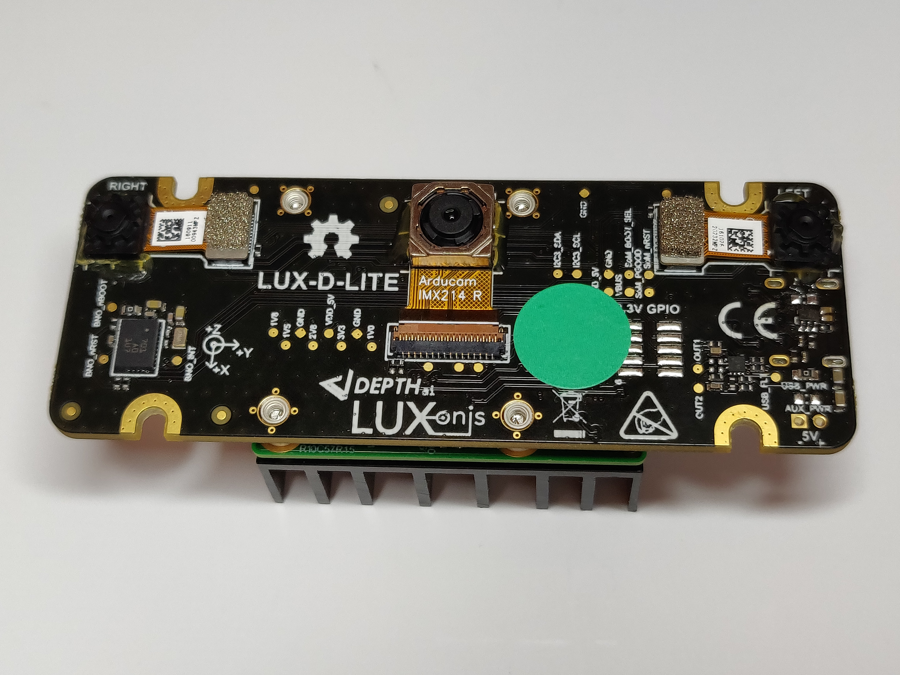
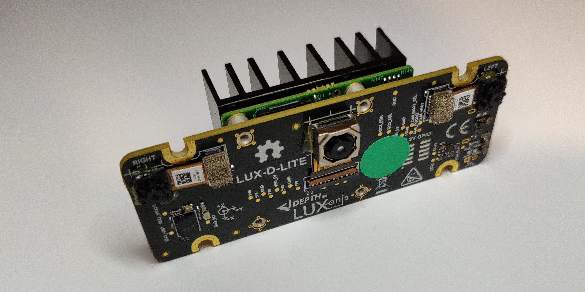
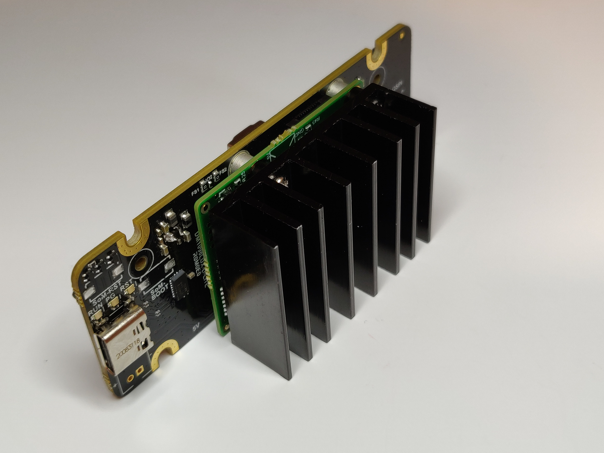
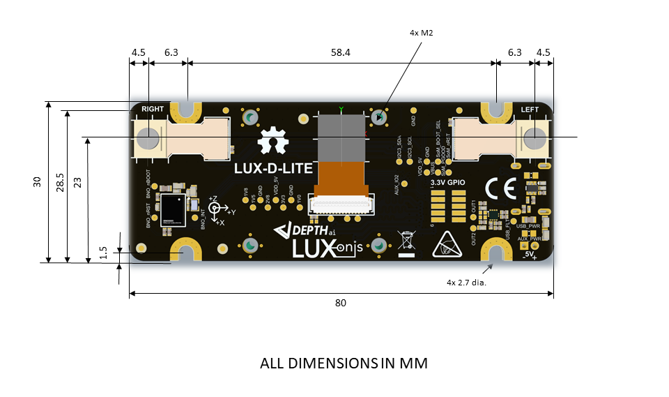

# OAK-D-LITE-DEV USB3C Baseboard

# Project Stage

This design is now vetted and documents revision updated with corrections. 

# Overview

This repository contains open hardware designed by Luxonis, and meant to be used as a baseboard for the [Luxonis](https://www.luxonis.com/depthai) BW1099 DepthAI SoM. The OAK-D-LITE-DEV baseboard has three on-board cameras which implement stereo and RGB vision, piped directly into the DepthAI SoM for depth and AI processing. The data is then output to a host via USB 3.1 Gen1 (Type-C). 

More about the "why" are we making this product available and open sourcing you can read in an opened issue [#55.](https://github.com/luxonis/depthai-hardware/issues/55)

## Repository structure:
* `PCB` contains the packaged Altium project files
* `Docs` contains project output files
* `Images` contains graphics for readme and reference
* `3D Models` contains generated 3D models of the board
* `Mechanical` contains models of mounts, enclosures, and other mechanical parts

# Key features
* OV7251 (640x480) 
* IMX214 (13MP)
* Support for on-board stereo and RGB camera modules
* Interface for Luxonis BW1099 DepthAI SoM
* **USB3 Type-C** power only requires USB3-capable host, or USB2 host that can provide 900mA - for example RPi3 and RPi4 
* USB 3.1 Gen1 Type-C
* No enclosure, just the PCBA.
* Design files produced with Altium Designer 20

# Board layout & dimensions

# Getting started
The OAK-D-LITE-DEV is powered via USB Type-C connector and requires USB3-capable host, or USB2 host that can provide 900mA. USB3 5-Gbps speeds are standard for streaming video or data from the device. With cameras and the DepthAI SoM, total power consumption usually stays below the 900mA specification of USB3. 

The reset button is not populated by default on the OAK-D-LITE-DEV, but can be added. Alternatively, the BW1099 SoM can be reset by shorting RST to ground. The boot select button footprint is also present on PCB, so alternatively if BW1099EMB is used and boot option is set to NOR flash boot, this button can be used as USB recovery boot. 

The "RUN" LED indicates that 5V power is present on the OAK-D-LITE-DEV. The  "PG" LED indicates power good from the DepthAI SoM. The "RUN" LED indicates that the DepthAI SoM is not in reset.  

# Revision info
These files represent the DM1095_R0M0E0 revision of this project. Please refer to schematic page, `Project_Information.SchDoc` for full details of revision history.
