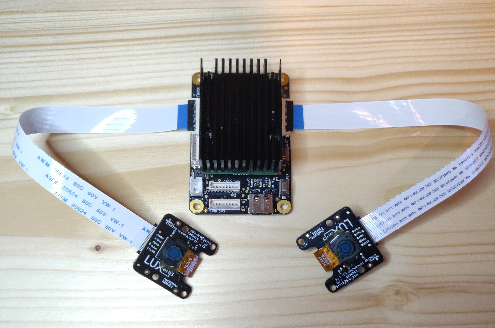
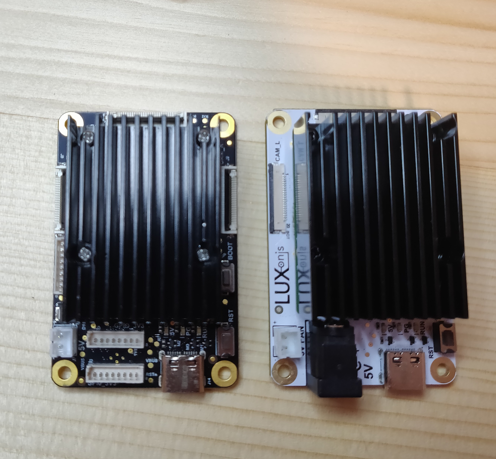

# DM1098EMB DepthAI USB3 Edition

DM1098EMB + [OAK-FFC-OV9282](https://github.com/luxonis/depthai-hardware/tree/master/DM0250TG_DepthAI_Mono_Camera/R0M0E0) are shown together below:

# Project Stage

**Caution: This design shouldn't be used in a new products or as a reference for new designs.**        

**If you need a replacement for DM1098EMB, please contact Luxonis support and we will send you OAK-FFC-3P-OG (DM1098FFC) or OAK-FFC-3P (DM1090FFC) which are both improved versions of this design.**

**For customers who do need this -exact- design, we maintain stock and can get you stock.  Reach out to support at luxonis dot com if that is the case.**   

**For new projects FFC reference design OAK-FFC-3P is located [here](https://github.com/luxonis/depthai-hardware/tree/master/DM1090FFC_DepthAI_USB3) .** 

# Overview

This repository contains open hardware designed by Luxonis, and meant to be used as a baseboard for the [Luxonis](https://www.luxonis.com) BW1099EMB DepthAI SoM. The BW1098EMB baseboard has three FFC interfaces which allow for two [OAK-FFC-OV9282](https://github.com/luxonis/depthai-hardware/tree/master/DM0250TG_DepthAI_Mono_Camera/R0M0E0) camera modules (stereo pair) and one [OAK-FFC-IMX378](https://github.com/luxonis/depthai-hardware/tree/master/DM0249_DepthAI_RGB_Camera/R0M0E0) RGB camera module.

# Repository structure:
* `PCB` contains the packaged Altium project files
* `Docs` contains project output files
* `Images` contains graphics for readme and reference
* `3D Models` contains generated 3D models of the board
# Key features
* 2 OAK-FFC-OV9282 mono camera module interfaces
* 1 OAK-FFC-IMX378 RGB camera module interface
* 5V power input via 2 pin JST connector
* USB 3.1 Gen 1 Type-C
* Connector for OAK-SoM 3.3V SPI0
* Connector for DepthAI SoM 3.3V GPIO 
* Connector for DepthAI SoM 1.8V AUX IOs (I2C, UART, GPIO)
* Pads for DepthAI SoM aux signals
* Design files produced with Altium Designer 20

# Board layout & dimensions

Dimensions for all USB3 FFC designs are kept the same as for first iteration of this design group which was BW1098FFCR0M0E0 design that can be seen on the picture below. So the overall size and dimensions of the DM1098EMB_R0M0E0 is the same as represented below:    

## Layout OAK-FFC-3P-OG (BW1098FFC/DM1098FFC) vs DM1098EMB:

 

Above picture; Left: DM1098EMB, Right:  OAK-FFC-3P-OG

The key difference is the power connector - the DM1098EMB does not have a barrel jack, but rather just the JST connector for 5V power which is marked on silk screen as 5V. Both can also be powered over USB3 via a powered hub or a device that can supply USB3 power (5W). 

Below picture; Left: OAK-FFC-3P-OG, Right: DM1098EMB

For detailed mechanical properties you can find 3D CAD model in [3D_Models](https://github.com/luxonis/depthai-hardware/tree/master/DM1098EMB_DepthAI_USB3/3D_Models) folder. 

# Getting started  

The DM1098FFC accepts 5V (+/-10%) from a 2-pin JST connector and , and interfaces to a host via USB 3.1 Gen1 Type-C. With cameras and the DepthAI SoM, total power consumption usually stays below the 900ma specification of USB 3, but Type-C power of 1.5A or greater is recommended. 

Interfacing with the DepthAI SoM is also possible with 8pin 1.25mm Molex Picoblade connectors. Connectors used are the [Molex 53047-0810](https://www.molex.com/molex/products/part-detail/pcb_headers/0530470810), mating connectors and cable assemblies can be found on the link, we would normally ship the following cable assembly if bought as Kit: [Molex 151340802](https://www.molex.com/molex/products/part-detail/cable_assemblies/0151340802) . 
Please refer to the schematics for pinout information. 

The reset button resets the Luxonis DepthAI SoM only, and the BOOT button forces USB boot for recovery mode in case DepthAI NOR flash boot header is corrupted during development.  

The 5V LED indicates 5V power is present on the DM1098EMB. The PG LED indicates "power good" from the DepthAI SoM. The "RUN" LED indicates that the DepthAI SoM is not in reset.

# Camera Usage

This board is compatible with the [OAK-FFC-IMX378](https://github.com/luxonis/depthai-hardware/tree/master/BG0249_DepthAI_RGB_Camera), connected to the `RGB` FFC port and [OAK-FFC-OV9282](https://github.com/luxonis/depthai-hardware/tree/master/BG0250TG_DepthAI_Mono_Camera), connected to the `CAM_L` and/or `CAM_R` port.
This board is also compatible with **R0M0E0 revision** of the [OAK-FFC-IMX378](https://github.com/luxonis/depthai-hardware/tree/master/DM0249_DepthAI_RGB_Camera/R0M0E0), connected to the `RGB` FFC port and [OAK-FFC-OV9282](https://github.com/luxonis/depthai-hardware/tree/master/DM0250TG_DepthAI_Mono_Camera/R0M0E0), connected to the `CAM_L` and/or `CAM_R` port. 

Please note that this design is compatible only with  OAK-FFC-IMX378 and OAK-FFC-OV9282 **R0M0E0 revision**, as later revisions as **R1M1E1** and up use different 26-pin FFC interface for connecting to USB3 FFC boards like [OAK-FFC-3P](https://github.com/luxonis/depthai-hardware/tree/master/DM1090FFC_DepthAI_USB3).

# Revision info

These files represent the R0M0E0 revision of this project. Please refer to schematic page, `Project_Information.SchDoc` for full details of revision history.

