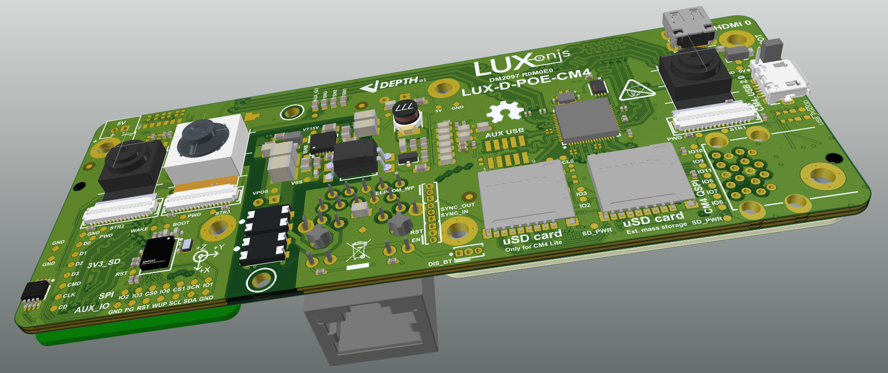
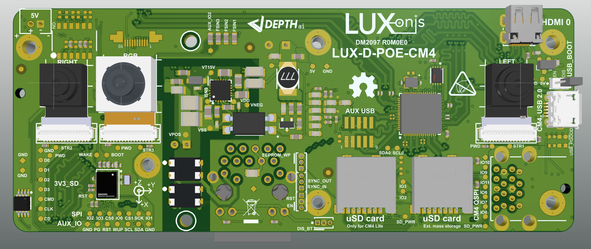
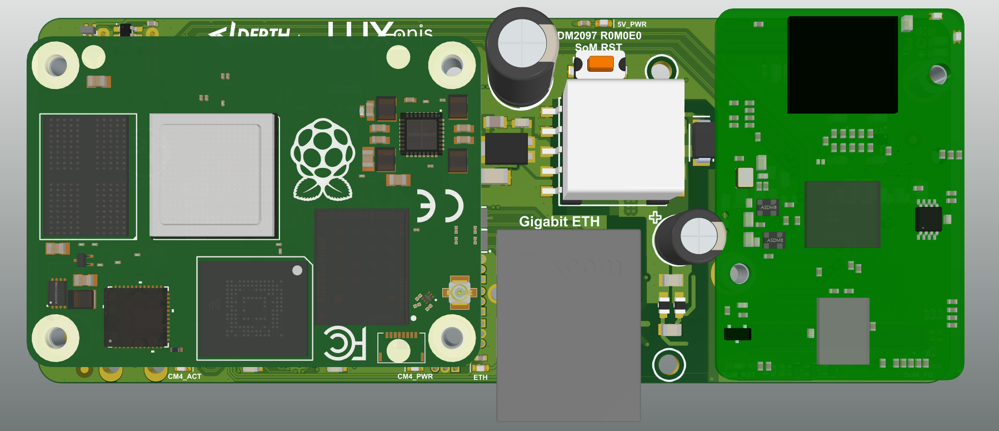

# OAK-D-CM4-POE DepthAI for Compute module 4

[Documentation here](https://docs.luxonis.com/projects/hardware/en/latest/pages/DM2097.html)

# Project Stage
This design is WIP and will be updated when first version of design is finished and sent out for prototyping.

# Overview
This repository contains open hardware designed by Luxonis, and meant to be used as a baseboard for the Luxonis BW2099 OAK SoM and the Raspberry Pi Compute Module 4.

Based on the DM1097 and Raspberry PI CM4IO board, the DM2097 combines a host and the Luxonis OAK SoM to allow for a fully integrated solution for real-time spatial AI.

This design will integrate PoE, IMU, prebuilt for enclosure, UBS3, connectors for developing and debugging which won't be populated in production later.

# Repository structure:
* `PCB` contains the packaged Altium project files
* `Docs` contains project output files
* `Images` contains graphics for readme and reference
* `3D Models` contains generated 3D models of the board
* `Mechanical` contains models of mounts, enclosures, and other mechanical parts 

# Key features
* Support for onboard stereo and RGB camera modules

* Interface for Luxnois OAK SoM 2099

* Interface for Raspberry PI CM4/CM4 Lite

* USB3 interface between CM4 and OAK SoM

* 2x USB3 (for development purpose only not stacked connector not populated in production)

* 1x Aux USB3

* Gigabit Ethernet connected directly to CM4

* Raspberry PI USB boot option (micro USB2)

* Micro HDMI output

* Support for 5V fan or Aux supply

* PoE supply integrated on board

* 2x microSD card support

* Design files produced with Altium Designer 20

  

# Board layout & dimensions

Try to keep the size of the PCB as small as possible.

# IP67 Water Sealed Enclosure

Like other PoE variants, OAK-D-CM4-PoE is IP67 Sealed.  Here it is being tested for hours in 1 meter of water:

# Getting started

The OAK-D-CM4-POE accepts power input from any 802.3af, Class 3 PoE circuitry.  So this for example includes any/every POE UniFi Switch (e.g. [US-8-150W](https://www.ui.com/unifi-switching/unifi-switch-8-150w/)) and any other standard POE switch and/or 802.3af POE injector (e.g. [here](https://www.amazon.com/Injector-U-POE-af-802-3af-Supported-Ethernet/dp/B07SH2NM9F/ref=sr_1_3?dchild=1&keywords=ubiquiti+48v+poe+injector&qid=1614832809&sr=8-3)).   Power consumption is typically 8W, leaving ~4.5W available if active lighting is desired additionally over POE/etc.

Raspberry PI USB boot can be accessed by setting a header jumper, which allows an initial flash of eMMC on CM4. Alternatively, the microSD slot can be used with a bootable system image. There is an additional slot for uSD card intended for mass storage devices.  

The reset button resets the Luxonis OAK SoM only. To reset the CM4/CM4 Lite, ground the `RUN` header via to the `GND` header via. To shutdown Bluetooth/WiFi, the `BT/WIFI_DISABLE` header can be used with `GND` on the center pin. To protect writing to EEPROM, gound `WP` header via to the `GND` header via. 

All those headers are not populated by default but can be added allowing those features. 

# Revision info
These files represent the R0M0E0 revision of this project. Please refer to a schematic page, `Project_Information.SchDoc` for full details of revision history. This design is a WIP and will be updated once finished and sent out for prototyping.

